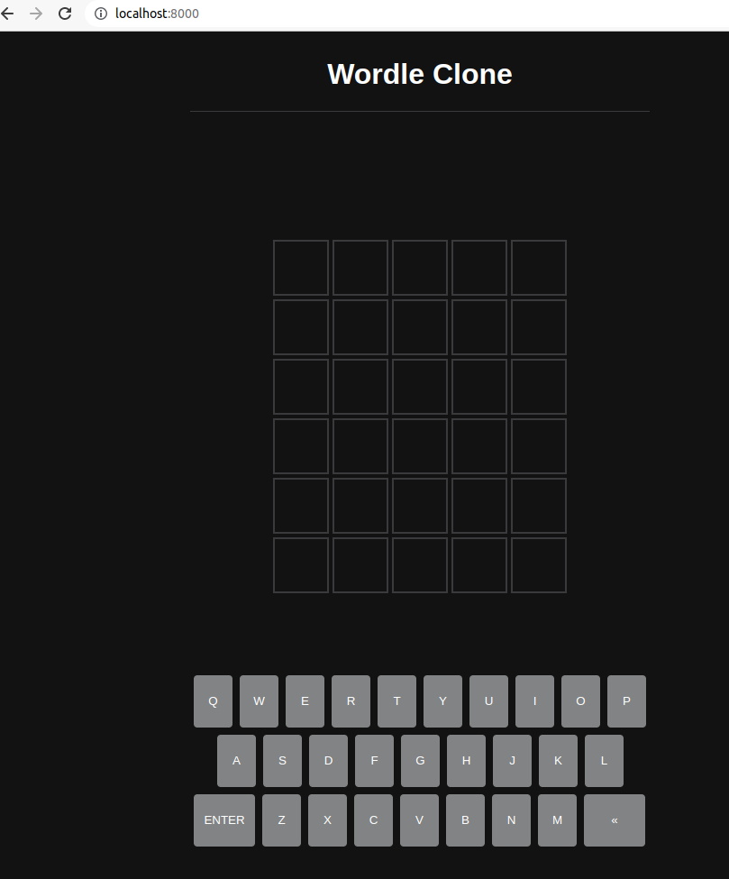

# Wordle Clone

This is a 1:1 clone based off the popular online game (now owned by NY Times) that you can set up and host to the entire Internet from your own PC (or wherever you decide to run this code, probably best on a Raspberry Pi or something you don't mind leaving on 24/7). Credit to [Kubowania](https://github.com/kubowania) for the Javascript algorithms.

### Dependencies

We will be using

- Node.js / NVM
- NGinx (for proxying)
- RapidAPI (for retrieving word)
- NoIP (for getting your real IP)

### Installation Instructions

1. Install Node.js (https://nodejs.org/en/) by following instructions from official site

2. Install NVM (https://github.com/nvm-sh/nvm) by following instructions from the github

3. RapidAPI

   We need a word and dictionary so sign up for the [APIs](https://bit.ly/rapidapi-hub).

   Now create a `.env` file in the root of your project with the following:

   ```
   RAPID_API_KEY={your_rapid_api_key}
   ```

4. Install & Run NGinx

   Assuming you're using a linux/Raspberry Pi to host:

   ```bash
   sudo apt install nginx
   sudo /etc/init.d/nginx start
   ```

5. Proxy'ing 

   Get your IP via `ifconfig` or `hostname -I`

   Modify the /etc/nginx/sites-available/default file by adding in:

   ```bash
   server {
          listen 80 default_server;
          listen [::]:80 default_server;
   
          server_name _;
   
          root /var/www/html;
   
          location / {
          		  proxy_pass http://localhost:8000;
                 try_files $uri $uri/ =404;
          }
   
   ```

   Apply changes:

   ```bash
   sudo /etc/init.d/nginx restart
   ```

6. Getting a static IP and Port forward on Router

   Sign up for https://www.noip.com/ and follow the [installation instructions](https://www.noip.com/support/knowledgebase/installing-the-linux-dynamic-update-client-on-ubuntu/)

   TAKE NOTE of your STATIC IP here

   

   Now we can enable port forwarding by going to your router's admin page and adding a new forwarding rule. You can check here for how to do it for your specific router: https://portforward.com/router.htm

   This rule will connect any external Starting & Ending port to Port 80, and then any Internal Starting and Ending Port to Port 80 as well. If it asks for Internal IP, use the IP you got from the hostname/ifconfig command, and use Any for the external. 

### Running

To run this project please type the following commands:

```bash
npm i
```

This will install all the necessary dependencies listed in the package.json file.

```bash
npm run start
```

This will start the website on [http://localhost:8000](http://localhost:8000/). Where it's proxy'd via NGinx and can be relayed to all players.

Open a web browser and enter in your external IP from NoIP to see the game and play.

You can also just play locally by navigating to that localhost without ever spinning up NGinx.




